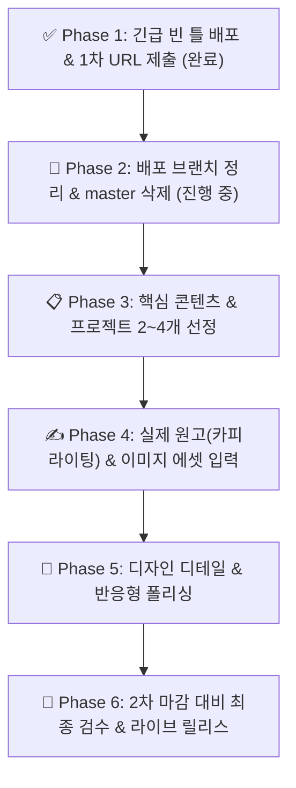

# AI/LLM 엔지니어 포트폴리오 종합 실행 계획 (로드맵)

> **상황 요약**: 1차 서류 제출용 라이브 링크(`https://tryfasting.github.io`)는 어제 밤 빈 틀 상태로 선(先)배포 및 제출 완료되었습니다.  
> 이제 2차 전형 검토 전까지 **① 배포 브랜치 정리 → ② 실 프로젝트/이력 내용 선정 → ③ 실제 원고 및 이미지 입력 → ④ 디자인 디테일 다듬기 → ⑤ 최종 배포** 순서로 질적 완성을 추진합니다.

---

## 🗺️ 전체 실행 파이프라인

---

### [x] Phase 1. 기본 뼈대 구축 및 긴급 배포 (완료)
*목표: 1차 서류 마감 기한 내 라이브 URL 확보 및 빈 틀 정상 호스팅*
1. [x] **Swissfolio 스위스 그리드 틀 구현**: Pretendard 단일 폰트, 반응형 스케일 및 모노크롬 베이스 레이아웃.
2. [x] **단일 진실 공급원(SSOT) 규칙 수립**: [`policy/design-tokens.md`](../policy/design-tokens.md) 및 특이도(Specificity) 충돌 방지.
3. [x] **GitHub Pages 배포 파이프라인 구축**: GitHub Actions 기반 Astro 자동 빌드/배포 워크플로우([`.github/workflows/deploy.yml`](../.github/workflows/deploy.yml)).
4. [x] **1차 제출용 URL 호스팅 검증**: `https://tryfasting.github.io` 접속 정상 확인 및 제출 완료.

---

### [x] Phase 2. 브랜치 전략 확립 & master 삭제 (완료)
*목표: 작업 브랜치(`main`)와 배포 브랜치(`deploy`)의 역할을 분리하고, 불필요한 `master`를 정리하여 배포 보호 규칙 에러 원천 차단*
1. [x] **전용 배포 브랜치(`deploy`) 생성 및 푸시**: 원격 `origin/deploy` 생성 완료.
2. [x] **워크플로우 배포 트리거 설정**: `deploy.yml` 최신 Node 24 지원 및 브랜치 연동 완료.
3. [x] **GitHub 저장소 Default Branch 변경**: GitHub Settings에서 `main`으로 전환 완료.
4. [x] **GitHub Pages 환경 보호 규칙(Environment Protection Rules) 갱신**: `github-pages` 환경에서 `deploy` 및 `main` 브랜치 배포 권한 승인 완료.
5. [x] **원격 `master` 브랜치 완전 삭제**: `git push origin --delete master` 완료 (원격 저장소 완전 정리).

---

### [ ] Phase 3. 핵심 콘텐츠 및 타겟 프로젝트 선정
*목표: 한화금융 및 엔터프라이즈 AI/LLM 엔지니어 채용 기준에 최적화된 핵심 역량 도출*
1. [ ] **메인 프로젝트 2~4개 선정**:
   - 금융/엔터프라이즈 워크플로우 자동화 멀티 에이전트 프로젝트
   - 사내 문서 RAG 파이프라인 (검색 정확도 개선, Chunking, 하이브리드 서치)
   - LLM 파인튜닝 / vLLM 서빙 / 경량화(LoRA) 및 정량적 평가 체계 구축 경험
2. [ ] **경력 및 교육(Experience & Education) 이력 정리**:
   - 실무 프로젝트, 부트캠프, 주요 교육 이수 내역
   - 단순 나열이 아닌 정량적 성과 지표(Latency 40% 단축, 정답률 18% 향상 등) 추출
3. [ ] **기술 스택(Tech Stack) 범주화**:
   - Model & Serving / Agent & Orchestration / Data & Vector DB / DevOps & Tools

---

### [ ] Phase 4. 실제 원고 작성 및 시각 에셋 입력 (Copywriting & Assets)
*목표: `[이름]`, `[기관명]` 등 모든 플레이스홀더를 제거하고 신뢰도 높은 엔지니어링 포트폴리오로 전환*
1. [ ] **기본 인적 사항 & 소셜 링크 연동**:
   - 실제 성명, 직무 서브타이틀, 이메일, GitHub, LinkedIn 실제 URL 연동.
2. [ ] **엔지니어링 스토리텔링 원고 확정**:
   - Overview: 비즈니스 도메인과 LLM 기술을 연결하는 문제 해결 접근법.
   - Core Principles: 신뢰성, 정합성, 비용 효율성 중심의 엔지니어링 철학.
3. [ ] **시각 에셋(Images) 실물 반영**:
   - 본인 실제 프로필 사진(고해상도 비즈니스 캐주얼) 등록.
   - 프로젝트별 아키텍처 다이어그램 / 파이프라인 구조도 / UI 데모 이미지 생성 및 배치 (플레이스홀더 제거).

---

### [ ] Phase 5. 디자인 디테일 & 반응형 폴리싱 (Design Polish)
*목표: Swissfolio 특유의 단정함과 세련미 극대화*
1. [ ] **변량 탐색(c1~c3) 결과 중 최적 요소 결합**:
   - 헤드라인 단독 행 배치 vs 프로필 사진 비례 조율.
   - 오렌지 포인트 컬러(`--color-accent`: `#EA580C`) 적정 강도 유지 (3% 이내 절제미).
   - 프로젝트 카드 간격 및 리듬감 확정.
2. [ ] **반응형 뷰포트 최종 검수**:
   - 데스크톱(1440px), 태블릿(768px), 모바일(375px) 크로스 브라우징 검수.

---

### [ ] Phase 6. 2차 전형 최종 검수 및 라이브 릴리스 (Final Release)
*목표: 2차 심사위원이 열람했을 때 완벽한 사용자 경험 보장*
1. [ ] **SEO & OpenGraph 메타태그 설정**:
   - 카카오톡/슬랙/링크드인에 공유했을 때 뜨는 미리보기 카드(제목, 썸네일, 설명) 완비.
2. [ ] **`deploy` 브랜치 최종 병합 및 배포**:
   - `main`에서 검증된 최종 코드를 `deploy` 브랜치로 푸시하여 GitHub Pages 무중단 자동 릴리스.
3. [ ] **최종 라이브 사이트 검수**: `https://tryfasting.github.io`에서 모든 링크, 이미지, 텍스트 동작 검증.
